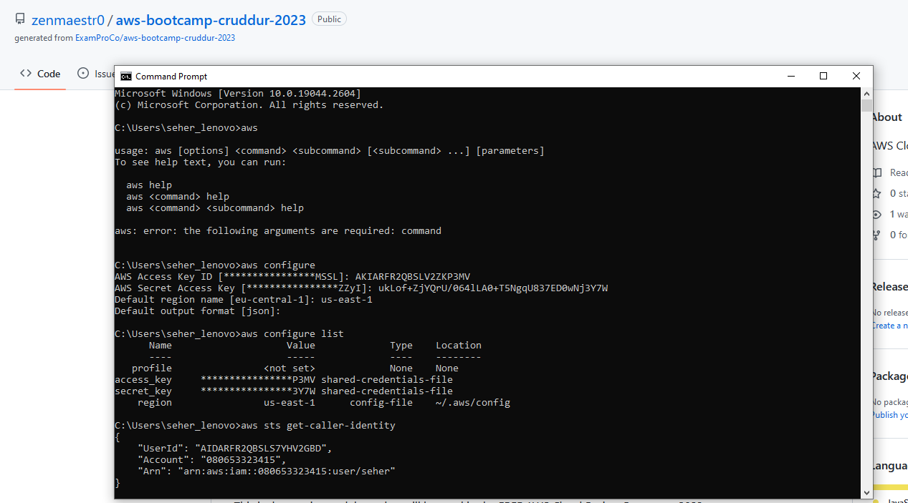

# Week 0 — Billing and Architecture

## Required Homework

### Verify AWS CLI installed and available

I have installed AWS CLI for Windows 10 last summer, so I don’t have to do it again.

The screenshot below shows the output of ```aws configure``` and ```aws sts get-caller-identity``` commands.



## Homework Challenges
