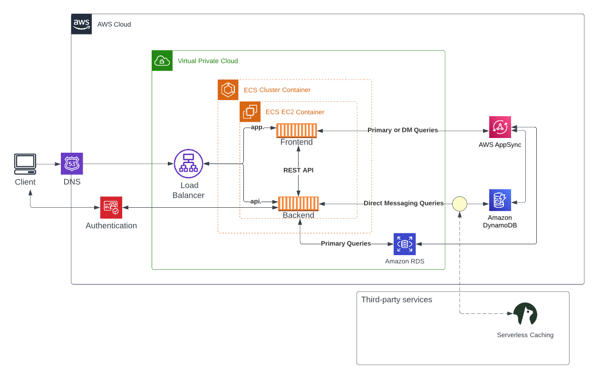

# Week 0 — Billing and Architecture

## Required Homework

### Verify AWS CLI installed and available

I have already installed AWS CLI for Windows 10 on my PC last summer.

The screenshot below shows the output of ```aws configure``` and ```aws sts get-caller-identity``` commands.


### Recreate Conceptual Diagram in Lucidchart 

I have created a free account in Lucidchart and created the diagram below. It was pretty straightforward with the given example.


To view the diagram please use the following link: [Conceptual Diagram in Lucidchart](https://lucid.app/lucidchart/ef0061ff-3ec7-47bb-bc0c-909f8b6665a6/edit?viewport_loc=-99%2C-99%2C2536%2C1490%2C0_0&invitationId=inv_6b30c9d9-f94b-4bbb-80ca-7b6b73a3cf13)

### Recreate Logical Architectual Diagram in Lucidchart 

For the logical architecture I added AWS shapes library and followed the video instructions to discover the interface. I found Lucidchart quite a practical tool to generate complex diagrams.



To view the diagram please use the following link: [Logical Architectual Diagram in Lucidchart](https://lucid.app/lucidchart/ef0061ff-3ec7-47bb-bc0c-909f8b6665a6/edit?viewport_loc=83%2C184%2C1892%2C1112%2C7W0yKF7Y-Qza&invitationId=inv_6b30c9d9-f94b-4bbb-80ca-7b6b73a3cf13)

I was able to create both diagrams without starting a free trial.

### Create a Budget and Billing Alarm

I created my low budget of 1$.


I have created a billing alarm and budget only via AWS console, which I was somehow familiar with.

For a future reference, I added the template file in the repo  so that I can create an alarm via AWS CLI.


